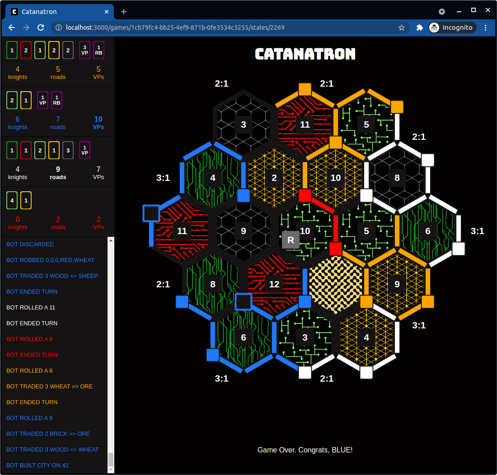
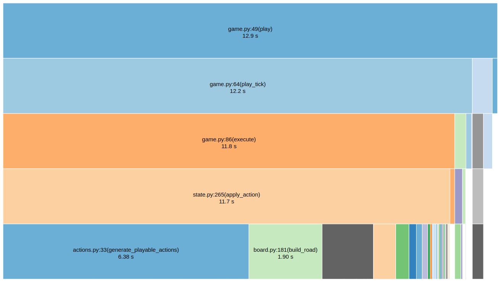
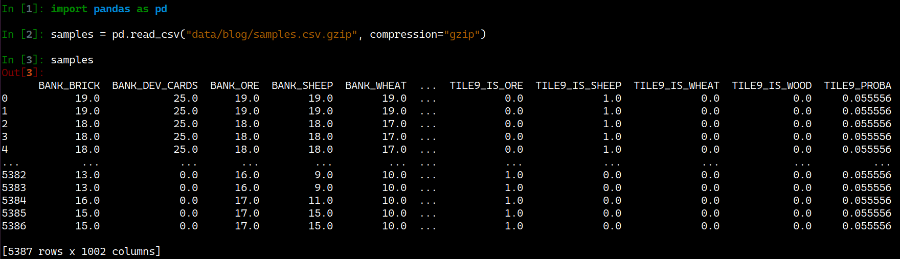
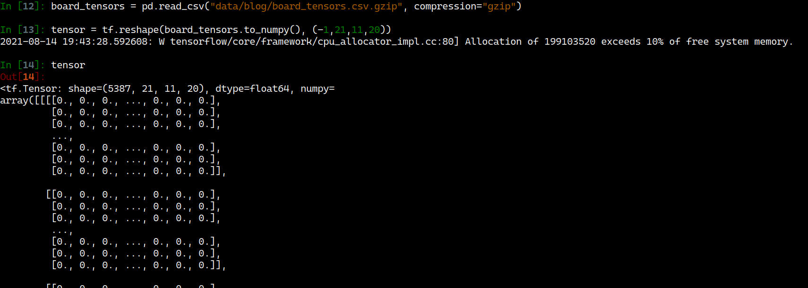
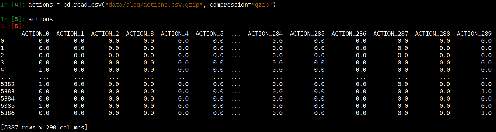
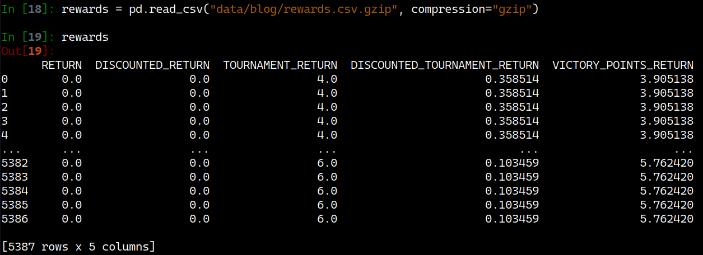
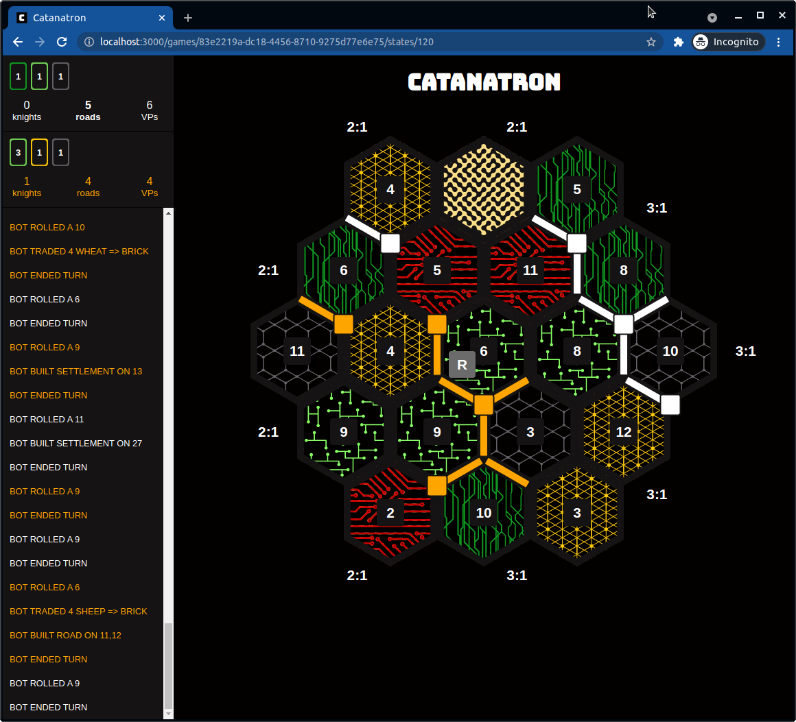
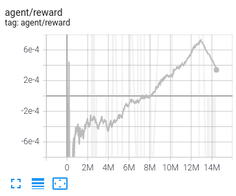
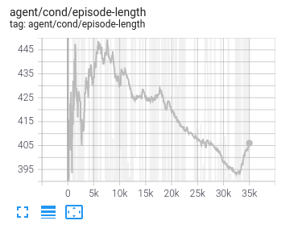

# 5 Ways NOT to Build a Catan AI

During the pandemic, I started playing online Settlers of Catan (shoutout to https://colonist.io!). I quickly realized there is more skill involved than one may think (i.e. there are players that consistently make it to the US National Championship); and this made the game beautiful for me.

At the same time, I was amazed at the recent success of the AlphaGo team, at making a superhuman player in the games of Chess, Shogi, and Go, with a seemingly simple algorithm.

These two interests prompted me to take a shot at making a superhuman artificial intelligence player for Catan. Spoiler Alert: I found many ways that did't work.

The purpose of this post is to share these attempts so that others can take these findings further.

## Idea and Basic Implementation

There were two main approaches I wanted to explore. The first was to use Reinforcement Learning (like AlphaZero) and the other was to use Supervised Learning to build a data-driven "value function" (a function that tells us how good the position of a given player is). For both of these I needed to implement the core game so as to simulate millions of games.

I choose to implement the core game logic in Python, not only because it's my favorite language, but because of its rich ecosystem of machine learning libraries (e.g. TensorFlow, Numpy, Pandas, Sklearn).

I also built a GUI (graphical user interface) since it would've otherwise been nightmare to debug. I made it browser-based in React; this is what it looks like:

<p align="center">
 
</p>
<p align="center">Catanatron Web UI</p>

## Benchmarks

Before diving into the fancy approaches, it was important to have solid benchmark bot implementations to measure strength against. I implemented three of these; outlined below.

### 1. Random

The most basic benchmark is the bot that takes actions completely at random (i.e. `random.choice(playable_actions)`), I call it `RandomPlayer`. It plays pretty poorly so losing to this bot, would represent inmense misfortune.

### 2. Weighted Random

The second (slightly better) benchmark, was what I call the `WeightedRandomPlayer`. This bot takes actions at random too, except when “build city”, “build settlement”, or “buy development card” are possible actions. In these cases its skewes its random selection to heavily favor these (in that order). This is basically strictly improving `RandomPlayer` slightly by saying “if you can build a city, do it”. This was inspired by [this paper](https://www.researchgate.net/publication/220716999_Monte-Carlo_Tree_Search_in_Settlers_of_Catan), and it indeed played considerably better. You can see its implementation [here](https://github.com/bcollazo/catanatron/blob/master/catanatron/catanatron/players/weighted_random.py) and see how it wins ~60% of the games against `RandomPlayer`:

```
RandomPlayer:RED           [3834]  █████████████████████████
WeightedRandomPlayer:BLUE  [6120]  ████████████████████████████████████████
```

<p align="center">Result of 10,000 1v1 games between WeightedRandomPlayer and RandomPlayer</p>

### 3. Value Function

Lastly, another easy-to-implement yet decent benchmark would be a bot that calculates a hand-crafted "score" of the state of the game, and selects actions so as to greedily maximize this value.

Simply, we can make this score be the sum of quantities like the number of active knights, the total amount of production points, the number of victory points, the length of longest road, and more quantities that talk about and characterize how well-positioned a player might be. We also get to set in what proportion these are combined (i.e. if we think "number of active knights" is 2.5x more valuable than "number of production points", we could make it so).

This bot was _much_ better than `RandomPlayer` and `WeightedRandomPlayer`. Although not superhuman, it may beat some first-timers. This was already quite an encouraging finding, since this approach can be continuously improved by either more innovative "features" (the quantities or metrics that characterize how good a player's position is) and/or further tuning of their respective "weights" (the proportions; that 2.5x in the example above).

```
RandomPlayer:RED                              [  1]
WeightedRandomPlayer:BLUE                     [  8]  ▍
ValueFunctionPlayer:ORANGE(value_fn=base_fn)  [991]  ████████████████████████████████████
```

<p align="center">3-player Catan between `RandomPlayer`, `WeightedRandomPlayer` and `ValueFunctionPlayer`</p>

You can find the "features" and "weights" I am using for this bot [here](https://github.com/bcollazo/catanatron/blob/master/catanatron/players/minimax.py#L25).

### Performance

As a side note, after implementing the above `ValueFunctionPlayer` we found that games were taking too long (~10 secs each). This primarily happened because in order to see how actions changed the state (without interfering with the actual game being played), we had to make copies of the state. At the time, the state was a complex Python object that we'd copy via `copy.deepcopy`, which was slow.

Since then we have moved the implementation to a more functional style in which copying a game is a matter of copying a Python dictionary of primitives, which is much faster. This and other performance optimizations made us achieve millisecond speeds for each game. This is where most time is spent now:

<p align="center">
 
</p>
<p align="center">Performance of running 100 4-player RandomPlayer games.
    As you can see ~50% time is move generation and ~50% is state mutation. This is similar to what I understand [Stockfish](https://towardsdatascience.com/dissecting-stockfish-part-1-in-depth-look-at-a-chess-engine-7fddd1d83579) exhibits.</p>

## Superhuman Attempts

With these benchmarks in place, we can now start the search for better and better bots with more sophisticated approaches. Anything beating `ValueFunctionPlayer` would be considered promising.

The first attempt was to see how basic Reinforcement Learning algorithms would perform. The two algorithms I tried were the [Cross Entropy Method](https://towardsdatascience.com/solving-a-reinforcement-learning-problem-using-cross-entropy-method-23d9726a737) and an [Online DQN](https://pythonprogramming.net/deep-q-learning-dqn-reinforcement-learning-python-tutorial/).

### Representations

For both these methods, we needed to encode the game state and actions as numerical vectors. To do this, we created a command-line tool that could create datasets of any number of simulated games, like so:

```
catanatron-play --players=R,R,R,R --num=5 --out=data/blog
```

This would execute five 4-player `RandomPlayer` games and output GZIP CSVs to the `data/blog` folder, encoding two representations of the states, the actions (hot-one-encoded), and the rewards for these games. Here's a preview of these datasets.

<p align="center">
 
 samples.csv.gz: A 1-D raw representation of game state.

 
 board_tensors.csv.gz: A 3-D tensor representation of the board state. Intented to be used for CNN-based approaches. Similar to the one described in [this](https://arxiv.org/abs/2008.07079) paper.

 
 actions.csv.gz: Hot-one-encoded actions taken by players in that state.

 
 rewards.csv.gz: Several "labels" we tried for each (state, action) pair. RETURN for example is 1 if player ultimately won, 0 otherwise.
</p>

For more information on these representations, look at the [action table](https://catanatron.readthedocs.io/en/latest/catanatron.gym.envs.html#catanatron.gym.envs.catanatron_env.CatanatronEnv.action_space) and [state table](https://catanatron.readthedocs.io/en/latest/catanatron.gym.envs.html#catanatron.gym.envs.catanatron_env.CatanatronEnv.observation_space).

## Attempt #1: Cross-Entropy Method and Online DQN

For the Cross-Entropy Method, I basically filtered the above datasets to the samples of the best N randomly-played games per "DISCOUNTED_RETURN" and trained a model on this. Similarly, for the DQN algorithm I made a custom implementation that didn’t perform well; it was also abysmally slow.

I suspect these approaches failed because:

- Bugs in the model training code.
- I didn't know how to filter to the top N-games without loading the dataset to memory. So I could only run Cross-Entropy Method with a arguably small dataset.
- Class-imbalance made bots predict “END TURN” many times. This I suspect happened because these datasets are imbalanced with “END TURN” samples, since during a game this is the most common action. In particular, ~30% of the time bots had nothing to do but to end their turn.
- The dataset generated is pretty much “garbage data” since they are randomly-played games.
- The action space was too big. I had an action space of more than 5,000 actions. This was due to me flattening the state-action tree with actions like “ROAD BUILDING AT EDGE i AND j” for every i and j, and separating initial building action with normal building actions (one could argue the first settlement is similar to building a settlement in general).

<!-- I later simplified this following [this paper](https://arxiv.org/abs/2008.07079). -->

## Attempt #2: Supervised Learning

From the RL approaches however I was inspired to learn a Value Function using RL-inspired labels. That is, build a neural network that takes in states and gives out scores. Since no filtering of samples was needed, it was also easier to run this approach with much more data (millions of samples) without loading it completely to memory.

In particular, I found _some_ promise when labeling states with what I called “VP_DISCOUNTED_RETURN”, which is basically a geometrically discounted sum of the total VPs eventually achieved in that game. The formula is: `(discount_factor ** num_turns) * vps_achieved`.

So if a bot won with 10 points in 1,000 turns, then all those samples would get labeled with (0.9999)<sup>1000</sup> \* 10 = 9.048. A bot that won in 300 turns however, will have (0.9999)<sup>300</sup> \* 10 = 9.704. The quicker you won, the higher the number.

I tried this with both the "1-D raw representation" and the "board tensor" representations, and although they showed improvement, `RandomPlayer` would still take too many games to indicate any promising strength.

```
RandomPlayer:RED        [14] ███████████████▏
RandomPlayer:BLUE       [15] ████████████████▎
VpReturnOneDim:ORANGE   [37] ████████████████████████████████████████
VpReturnTensor:WHITE    [34] ████████████████████████████████████▊
```

My suspicion here again was that the datasets are hard to predict since its random play. It might be interesting to integrate some sort of self-play interation framework on top of this, where what we just did is considered one "iteration" or "generation", and from here we generate dataset of "better" games, learn from those, and iterate.

## Attempt #3: Monte Carlo Tree Search

The MCTS algorithm is nicely explained [here](https://nikcheerla.github.io/deeplearningschool/2018/01/01/AlphaZero-Explained/), and its an important component of the AlphaZero algorithm.

Promisingly, we confirmed that in Catan the result of running 1,000 randomly-walked "playouts" from a given position, seemed also indicative of how good the position was. For example, in this board, who do you think is winning?

<p align="center">
 
</p>
<p align="center">Example intermediate game state.</p>

This “playouts property” says Orange's position can be valued at 0.691 (and White's position is a 0.309), since Orange wins 691 / 1000 games played at random from here. I’d say its an OK assessment (more roads, 1 knight up, and less blockable?).

Not promisingly, however, MCTS by itself doesn’t seem to be a way to “superhuman” play. In [this paper](https://www.researchgate.net/publication/220716999_Monte-Carlo_Tree_Search_in_Settlers_of_Catan) they found even with 10,000 simulations per turn, the author would fairly easily beat it. We confirmed this, and in our Python implementation the situation is worse since running 100 simulations takes ~3 seconds per turn. Too slow to suggest it's worth exploring more.

```
TODO:
```

Better than `WeightedRandomPlayer`, but again, not better than the simple `ValueFunctionPlayer`.

## Attempt #4: TensorForce Framework

By this point our chances of getting a superhuman Catan AI started to look pretty grim. Particularly, the fact that I was mostly using random-play to generate the datasets to be learned from, seemed to be an important blocker.

So, if anything ML-related was going to work, it seems it would have to have some sort of self-playing and self-improving component to it. Thus, I decided to pick up again the Reinforcement Learning approaches, but this time using an off-the-shelf implementation of the algorithms, to discard any possible bugs from my part. :D

After considering Stable Baselines, TF-agents, and others, I landed in TensorForce, because it was very approachable and had good documentation.

To my surprise, this did showed some improvement! After around 8 hours of training, the bot was beating the `RandomPlayer` 80% of the time. But then it would face a dip in the learning graph, and in general, this was still pretty inferior to the ValueFunctionPlayer.

<p align="center">
 
 
</p>
<p align="center">TensorForce Results</p>

Maybe I am just inpatient and this just need to be run for much more time.

## Attempt #5: Alpha Beta Search

At this point I have now given up on the Machine Learning approaches. I still think they might work but getting them to work seemed slightly out of scope for me.

The last tool in the arsenal was to try and add "search" to the `ValueFunctionPlayer`. There was only one slight modification that I did to the standard Alpha-Beta Minimax algorithm, which was to take the _expected value_ of the children when propagating values up the tree. This was to account for dice rolls, uncertainty in buying development cards, etc...

It actually worked like a charm! What I named `AlphaBetaPlayer` with depth=2, strictly increase the performance of `ValueFunctionPlayer`. Here are the results:

```
ValueFunctionPlayer:RED         [47]  ███████████████████████████████████▌
AlphaBetaPlayer:BLUE(depth=2)   [53]  ████████████████████████████████████████
```

Curiously increasing the search to 3-layers deep made the bot play worse than when searching 2-layers deep. I think its either a bug in the implementation or maybe looking too much ahead makes the bot go towards high-risk-high-reward plays that don’t pan out.

This bot plays pretty well, but is definitely not superhuman and seems to suffer a lack of long-term planning (e.g. it plays monopolies promptly).

## Conclusion

Although we didn't see superhuman play, this last approach showed strong play and its ripe to be incrementally improved. Its also particularly promising because this is how at a high-level the classical version of the [Stockfish Chess Engine](https://stockfishchess.org/) played, and it was superhuman (after many open-source contributions).

That is why I've made all this code open-source here: https://github.com/bcollazo/catanatron. Because I am sure there are some brilliant minds out there that can improve on it, and just like Stockfish is for Chess, Catanatron can be the strongest open-source engine for Catan.

You can clone the repo, install dependencies, and test your own ideas for improving on the best bot. If you find a change that beats the current best bot with statistical significance, please submit a Pull Request!

## PS: Future Work

I also still see possibility in the Reinforcement Learning approaches with a self-play component. For example, it could be very interesting to get either https://github.com/suragnair/alpha-zero-general or https://github.com/werner-duvaud/muzero-general working with Catanatron. I have implemented a Gym-like interface [here](https://github.com/bcollazo/catanatron/tree/master/catanatron/gym), but it is not clear to me how to adapt those repositories.
